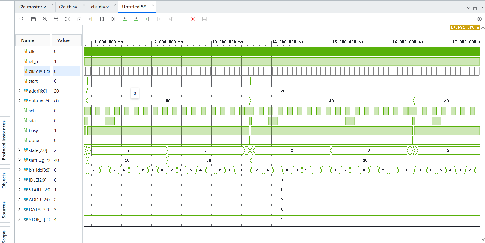

<div align="center">

# I²C Master — RTL Design & Verification

**A simplified I²C Master built in Verilog HDL, verified with a class-based SystemVerilog testbench, and carried through the full Vivado implementation flow.**


</div>

---

## Table of Contents

1. [Overview](#overview)
2. [Features](#features)
3. [I²C Transaction Format](#i²c-transaction-format)
4. [Architecture](#architecture)
5. [FSM Design](#fsm-design)
6. [Clock Divider](#clock-divider)
7. [RTL Module Reference](#rtl-module-reference)
8. [Verification Environment](#verification-environment)
9. [Assertions](#assertions)
10. [Functional Coverage](#functional-coverage)
11. [Simulation Results](#simulation-results)
12. [Vivado Implementation Flow](#vivado-implementation-flow)
13. [Project Structure](#project-structure)
14. [Tools Used](#tools-used)
15. [Limitations](#limitations)
16. [Future Improvements](#future-improvements)
17. [Learning Outcomes](#learning-outcomes)
18. [Author](#author)

---

## Overview

This project implements a simplified **I²C Master** controller in Verilog, performing a complete single-byte write transaction:

```
START  →  7-bit Address + Write bit  →  8-bit Data  →  STOP
```

It was simulated, verified, synthesized, implemented, and taken through bitstream generation in **Xilinx Vivado**.

> **Note:** This is an educational implementation. SCL and SDA are modeled as simple push-pull signals rather than true open-drain I²C lines, and there is no multi-master arbitration.

---

## Features

| Category | Details |
|---|---|
| RTL | FSM-based I²C master, 5-state controller, parameterized clock divider |
| Protocol | 7-bit addressing, write-only, START/STOP generation, `busy`/`done` status |
| Verification | Class-based SystemVerilog testbench (transaction, generator, driver, monitor, scoreboard) |
| Coverage | Directed corner-case + constrained-random, 16-bin address×data functional coverage |
| Assertions | Interface-level (blackbox) and FSM-level (whitebox, bound) SVA checks |
| Implementation | Synthesized, implemented, and bitstream-generated in Vivado |

---

## I²C Transaction Format

```
START
  │
  ▼
┌────────────────┬───────┐
│  7-bit Address  │ W = 0 │
└────────────────┴───────┘
        │
        ▼
   8-bit Data
        │
        ▼
      STOP
```

---

## Architecture

```
                         ┌─────────────────┐
                         │   System Clock   │
                         │       clk        │
                         └────────┬────────┘
                                  │
                                  ▼
                         ┌─────────────────┐
                         │  Clock Divider   │
                         │     clk_div      │
                         └────────┬────────┘
                                  │
                            clk_div_tick
                                  │
                                  ▼
 ┌──────────┐             ┌─────────────────────┐
 │  start   │────────────►│                     │
 │  addr    │────────────►│      I²C MASTER     │
 │  data_in │────────────►│                     │
 │  rst_n   │────────────►│   FSM Controller    │
 └──────────┘             │  shift_reg/bit_idx  │
                           └──────┬──────┬───────┘
                                  │      │
                                 SCL    SDA
                                  │      │
                                  ▼      ▼
                           ┌──────────────────┐
                           │      I²C BUS      │
                           └──────────────────┘
```

---

## FSM Design

| State | Encoding | Description |
|---|---:|---|
| `IDLE` | `3'd0` | Waits for `start`; bus idles high |
| `START_COND` | `3'd1` | Generates the I²C START condition |
| `ADDR_BITS` | `3'd2` | Transmits 7-bit address + write bit |
| `DATA_BITS` | `3'd3` | Transmits 8-bit data |
| `STOP_COND` | `3'd4` | Generates the I²C STOP condition |

```
              start = 1
          ┌──────────────┐
          │              ▼
      ┌────────┐    ┌─────────────┐
      │  IDLE  │───►│ START_COND  │
      └────▲───┘    └──────┬──────┘
           │                │  clk_div_tick
           │                ▼
           │         ┌─────────────┐
           │         │  ADDR_BITS  │
           │         └──────┬──────┘
           │                │  bit_idx == 0
           │                ▼
           │         ┌─────────────┐
           │         │  DATA_BITS  │
           │         └──────┬──────┘
           │                │  bit_idx == 0
           │                ▼
           │         ┌─────────────┐
           └─────────│  STOP_COND  │
                      └──────┬──────┘
                              │  clk_div_tick
                              ▼
                            IDLE
```

<details>
<summary><b>State-by-state behavior</b></summary>

**IDLE** — `SCL = 1`, `SDA = 1`, `BUSY = 0`. On `start`: latches `shift_reg = {addr, 1'b0}`, `bit_idx = 7`, `busy = 1`, moves to `START_COND`.

**START_COND** — SDA is pulled low while SCL is still high (the START condition). On the next `clk_div_tick`, SCL drops and the FSM enters `ADDR_BITS`.

**ADDR_BITS** — Serializes `{addr, 1'b0}` MSB-first, one bit per two `clk_div_tick`s (drive bit + raise SCL, then lower SCL). At `bit_idx == 0`, `data_in` is loaded and the FSM moves to `DATA_BITS`.

**DATA_BITS** — Serializes the 8-bit data byte MSB-first, same SCL sequencing as the address phase. At `bit_idx == 0`, moves to `STOP_COND`.

**STOP_COND** — SCL is held/raised high while SDA is driven high (the STOP condition). On the next `clk_div_tick`: `busy = 0`, `done = 1` (one-cycle pulse), and the FSM returns to `IDLE`.

</details>

---

## Clock Divider

`clk_div` generates a one-cycle `clk_div_tick` pulse every `DIVIDER` clock cycles (`DIVIDER = 8` in this project), pacing all SCL/SDA transitions in the I²C FSM.

```
clk:    _‾_‾_‾_‾_‾_‾_‾_‾_‾_‾_‾_‾_
count:  0 1 2 3 4 5 6 7 0 1 2 ...
tick:   ___________‾___________‾____
```

---

## RTL Module Reference

### `clk_div.v`

| Port | Dir | Width | Description |
|---|---|---:|---|
| `clk` | in | 1 | System clock |
| `rst_n` | in | 1 | Active-low async reset |
| `clk_div_tick` | out | 1 | One-cycle timing pulse |

**Parameter:** `DIVIDER = 8`

### `i2c_master.v`

| Port | Dir | Width | Description |
|---|---|---:|---|
| `clk` | in | 1 | System clock |
| `rst_n` | in | 1 | Active-low async reset |
| `clk_div_tick` | in | 1 | Timing pulse from `clk_div` |
| `start` | in | 1 | Pulse to start a transaction |
| `addr` | in | 7 | I²C slave address |
| `data_in` | in | 8 | Data byte to transmit |
| `scl` | out | 1 | I²C clock line |
| `sda` | out | 1 | I²C data line |
| `busy` | out | 1 | High during a transaction |
| `done` | out | 1 | One-cycle transaction-complete pulse |

**Internal registers:** `shift_reg` (serializes `{addr,1'b0}` then `data_in`), `bit_idx` (counts `7 → 0` per phase).

---

## Verification Environment

A self-checking, class-based SystemVerilog testbench (no UVM dependency — runs on plain XSIM):

```
  Generator ──► Driver ──► DUT ──► Monitor ──► Scoreboard
                                        │
                                        └──► Coverage
```

| Component | Role |
|---|---|
| `i2c_transaction` | Randomizable addr/data transaction, weighted toward corner values |
| `i2c_generator` | Emits 16 directed corner-case transactions, then constrained-random ones |
| `i2c_driver` | Drives `start`/`addr`/`data_in` onto the DUT |
| `i2c_monitor` | Passively decodes SCL/SDA bus activity back into a transaction |
| `i2c_scoreboard` | Compares driven vs. monitored transactions, tracks PASS/FAIL |
| `i2c_coverage` | Tracks address × data bin coverage |
| `i2c_env` | Wires the above together, runs the test |

---

## Assertions

| Level | Checks |
|---|---|
| Interface (blackbox) | SCL/SDA idle-high when not busy · no new `start` while `busy` · no X/Z on the bus |
| FSM (whitebox, bound) | `done` is a single-cycle pulse · `busy` only drops together with `done` · FSM state is always legal · `bit_idx` stays in range · FSM never sticks outside `IDLE` |

---

## Functional Coverage

Coverage is tracked over **address × data** bins:

| Bin | Address / Data range |
|---|---|
| `ZERO` | `0x00` |
| `LOW` | lower half of the range |
| `HIGH` | upper half of the range |
| `MAX` | `0x7F` (addr) / `0xFF` (data) |

`4 (addr bins) × 4 (data bins) = 16` combinations. The generator drives all 16 directed combinations first, then adds constrained-random transactions on top.

---

## Simulation Results

| Metric | Result |
|---|---:|
| Transactions run | 66 (16 directed + 50 random) |
| Scoreboard PASS | 66 |
| Scoreboard FAIL | 0 |
| Functional coverage | 16 / 16 bins (**100%**) |
| Assertion failures | 0 |

<p align="center">
  
  <br>
  <em>SCL/SDA/FSM activity during a transaction, captured in Vivado XSIM</em>
</p>

---

## Vivado Implementation Flow

```
Verilog RTL → Simulation → Synthesis → Implementation → Bitstream
```

| Stage | Status |
|---|:---:|
| RTL Design | ✅ |
| Functional Simulation | ✅ |
| Synthesis | ✅ |
| Implementation | ✅ |
| Bitstream Generation | ✅ |

> The RTL (`i2c_master` + `clk_div`) was synthesized and implemented independently of the testbench — SystemVerilog verification constructs (classes, mailboxes) are simulation-only and are never part of the synthesis fileset. Physical board-level I²C testing has not yet been performed; see [Future Improvements](#future-improvements).

---

## Project Structure

```
I2C_master/
├── rtl/
│   ├── clk_div.v       # Clock divider RTL
│   └── i2c_master.v    # I²C master FSM RTL
│
├── tb/
│   └── i2c_tb.sv        # Self-checking SystemVerilog testbench
│                        #   (interface, assertions, verification classes, tb_top)
│
├── constraints/
│   └── pynq_z2_i2c.xdc  # Pin/timing constraints for PYNQ-Z2 implementation
│
├── docs/
│   └── waveform.png     # Simulation waveform screenshot
│
├── README.md
└── .gitignore
```

---

## Tools Used

- **Verilog HDL** — RTL design
- **SystemVerilog** — verification environment
- **Xilinx Vivado** — simulation, synthesis, implementation, bitstream
- **XSim** — simulation engine
- **Git / GitHub** — version control

---

## Limitations

This is a simplified I²C master built for RTL design and verification learning. It does **not** currently include:

- ACK/NACK handling
- I²C read transactions
- True open-drain SDA/SCL
- Clock stretching
- Multi-master arbitration / bus collision detection
- Repeated START
- Multi-byte transfers

---

## Future Improvements

- [ ] ACK/NACK detection
- [ ] I²C read transaction support
- [ ] True open-drain SDA/SCL implementation
- [ ] Clock stretching support
- [ ] Repeated START support
- [ ] Multi-byte transfer support
- [ ] Configurable SCL frequency
- [ ] Multiple-slave transaction support
- [ ] Physical FPGA board-level testing with a real I²C peripheral

---

## Learning Outcomes

FSM-based RTL design · serial protocol sequencing · clock divider design · shift-register bit serialization · SystemVerilog class-based testbench architecture · SVA assertions · functional coverage closure · scoreboard-based self-checking verification · Vivado synthesis & implementation flow.

---

## Author

**MD Farhan Badar**
B.Tech, Electronics & Communication Engineering — VLSI Design & Technology
Jamia Millia Islamia, New Delhi

---

<div align="center">

**Status: RTL + Verification + Vivado Implementation — Complete**

</div>